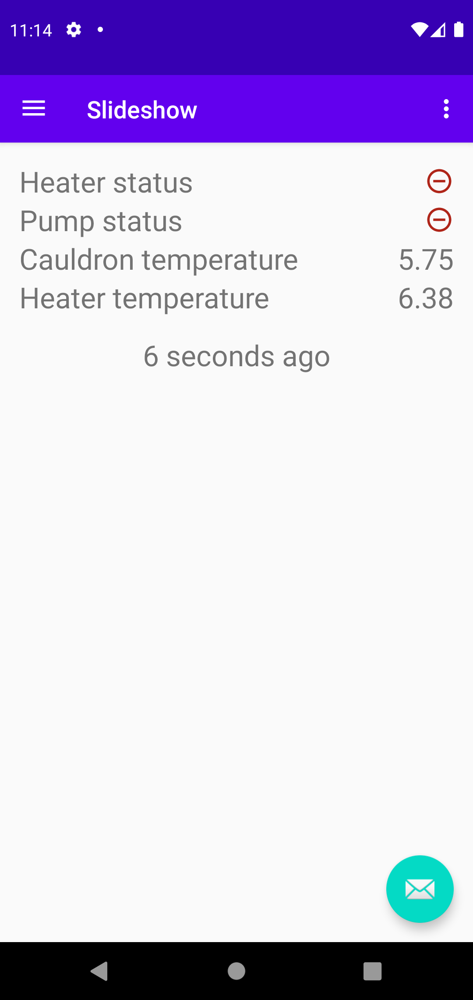

# Ranch Control KMM-style

Connects to my ranch and presents water temperatures there to you.

<div float="left">
    
</div>

# Dev tips

The *Kissme* library was hosted at *bintray* which is no more. To continue using it you first need to
make a local build of it with:

```bash
./gradlew publishToMavenLocal
``` 

This <a href="https://github.com/pratclot/Kissme/tree/bintray-workaround">fork</a> has *bintray* removed
and *maven-publish* plugin added.
